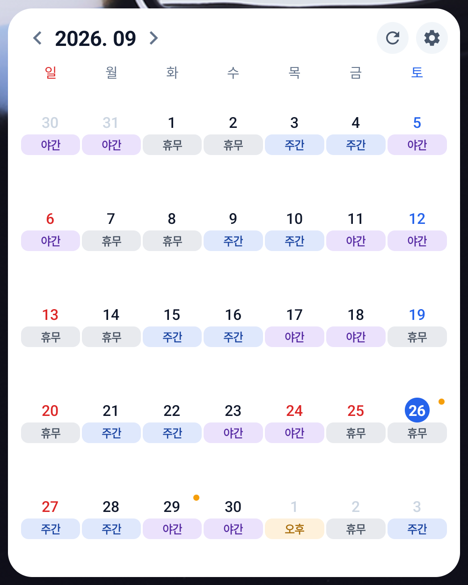
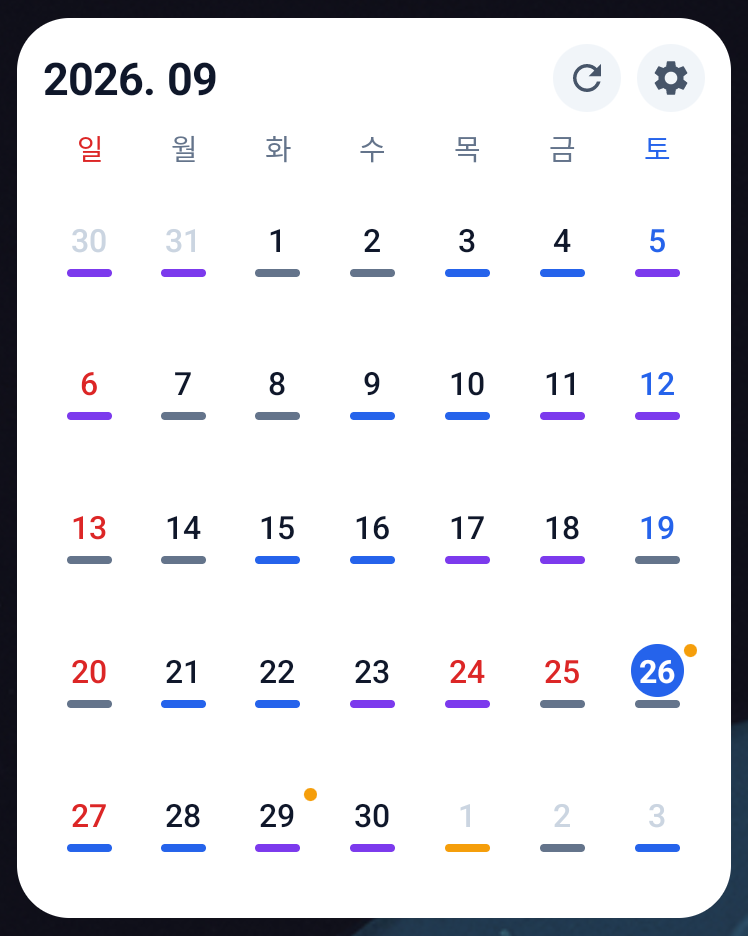
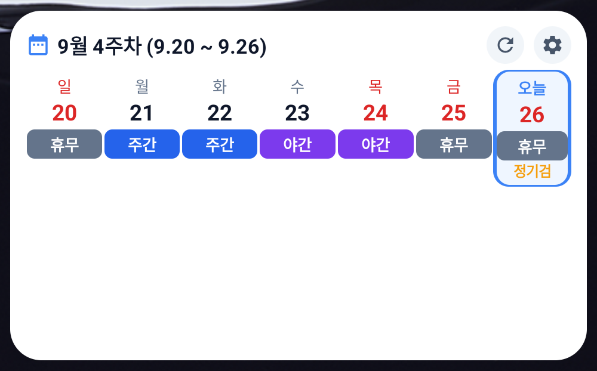
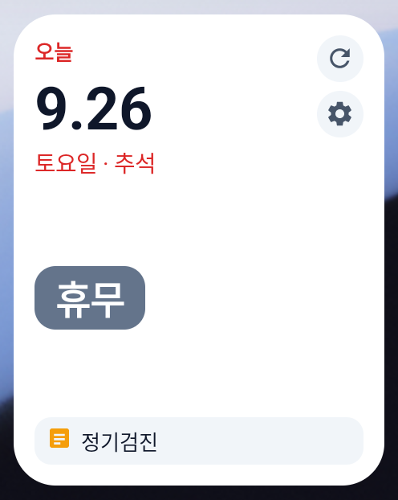
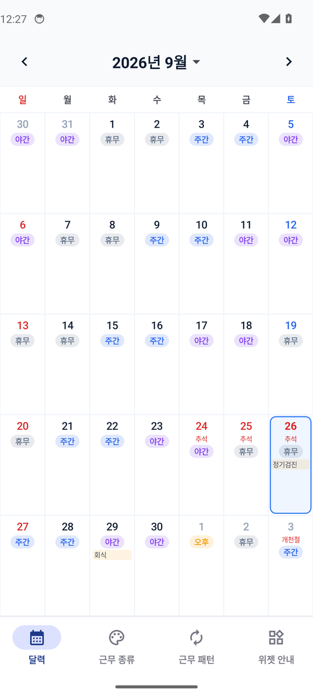

# 교대캘린더 위젯 (Shift Calendar Widget)

교대 근무자를 위한 안드로이드 달력 앱입니다. 근무 패턴을 한 번 등록하면 달력에 근무가 자동으로 채워지고, 홈화면 위젯으로 일정을 한눈에 볼 수 있습니다.

인터넷 연결 없이 완전히 오프라인으로 동작하며, 모든 데이터는 휴대폰 안에만 저장됩니다.

## 주요 기능

- **근무 종류 관리**: 주간, 야간, 비번, 휴무 등 이름과 색상을 자유롭게 정할 수 있습니다.
- **근무 패턴 등록**: 근무 순서와 시작 날짜를 정하면 그 순서가 계속 반복되며 달력에 채워집니다. 특정 날짜부터 다른 패턴으로 바꿀 수도 있습니다.
- **날짜별 수정**: 패턴과 다르게 근무하는 날은 그날만 따로 바꿀 수 있습니다.
- **메모**: 날짜마다 메모를 남기고, 달력과 위젯에서 미리 볼 수 있습니다.
- **음력, 공휴일 표시**: 음력은 인터넷 없이 휴대폰 안에서 계산하고, 한국 공휴일을 표시합니다.

## 홈화면 위젯 4종

| 위젯 | 크기 | 보여주는 내용 |
|------|------|---------------|
| 한달위젯 | 4x4 | 한 달 전체(최대 6주)와 근무, 메모 |
| 작은한달위젯 | 3x2 | 한 달 전체를 작게, 날짜와 근무 색 밑줄 |
| 일주일위젯 | 4x1 | 이번 주 7일의 근무와 짧은 메모 |
| 하루위젯 | 1x1 | 오늘 하루의 근무를 크게 |

위젯마다 배경색, 투명도, 글자 크기, 음력 표시 여부를 따로 설정할 수 있습니다. 위젯 윗줄의 년월을 누르면 앱 달력이 그 달로 열립니다.

## 스크린샷

> 가상 폰(Pixel, 안드로이드 14)에서 샘플 데이터로 찍은 화면입니다. (기준일: 2026-09-26)

| 한달위젯 | 작은한달위젯 |
|:---:|:---:|
|  |  |

| 일주일위젯 | 하루위젯 |
|:---:|:---:|
|  |  |

| 앱 달력 화면 |
|:---:|
|  |

## 개발 환경

- 언어: Kotlin
- 화면: Jetpack Compose (앱), Jetpack Glance (위젯)
- 데이터 저장: Room (휴대폰 내부 데이터베이스)
- 최소 안드로이드 버전: 8.0 (API 26), 대상 버전: API 35
- Java 17

## 빌드 방법

Android Studio에서 이 폴더를 열고 실행하거나, 명령줄에서 아래처럼 빌드합니다.

```bash
./gradlew assembleDebug
```

빌드된 설치 파일은 `app/build/outputs/apk/debug/app-debug.apk`에 생깁니다.

## 폴더 구성

```
app/src/main/java/com/pulmm/shiftcalendar/
├── data/     데이터베이스, 근무 종류·패턴·메모 저장
├── logic/    패턴 계산, 음력 변환, 공휴일
├── ui/       앱 화면 (달력, 근무 종류, 패턴, 위젯 안내)
└── widget/   홈화면 위젯 4종과 위젯 설정
docs/         설계 문서, 디자인 자료
tools/emu.sh  가상 폰(에뮬레이터) 미리보기 도우미
```

## 가상 폰 미리보기 (개발용)

`tools/emu.sh`로 에뮬레이터를 켜고, 앱을 설치하고, 위젯을 홈화면에 놓고, 화면을 캡처할 수 있습니다.

```bash
bash tools/emu.sh boot
```

사용할 수 있는 명령: `boot`, `install`, `fresh`, `start`, `seed`, `home`, `pin`, `shot`, `tap`, `swipe`, `back`
